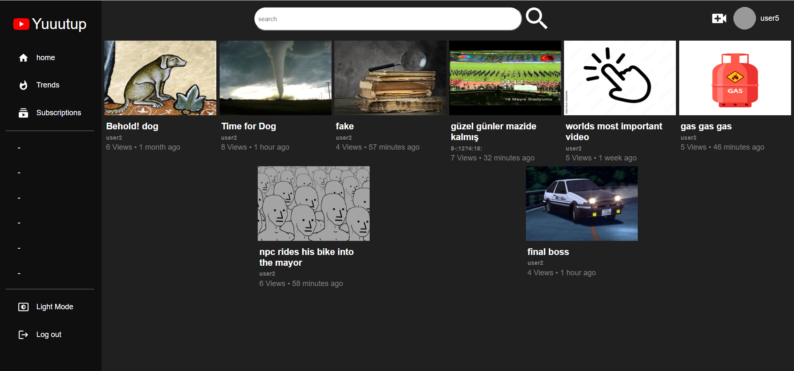

# Youtube clone project

This project represents my first attempt at using the MERN stack. it helped me grasp fundamental web development concepts and gain proficiency in JavaScript. The aim was to create a YouTube-like platform.

Key Features:
- User registration and login, including Google authentication
- Video uploading
- Liking/disliking videos
- Subscription management
- Commenting system

Technologies Used:
- MongoDB
- React
- Node.js
- Express.js
- Redux
- Firebase
- Render

References:

Screenshots:

